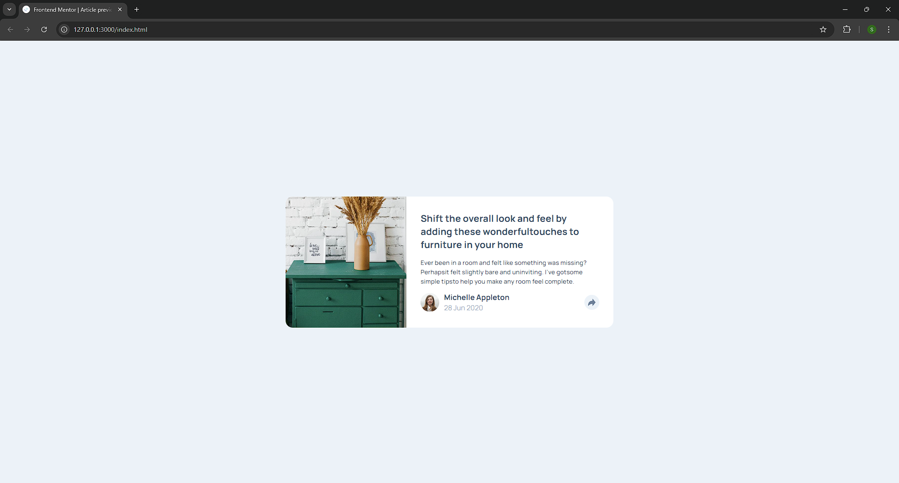

# Frontend Mentor - Article preview component solution

This is a solution to the [Article preview component challenge on Frontend Mentor](https://www.frontendmentor.io/challenges/article-preview-component-dYBN_pYFT).

### Screenshot

### Links

- Solution URL: [here](https://www.frontendmentor.io/solutions/article-preview-component-solution-MtN-ZfSfPh)
- Live Site URL: [here](https://sunilbaghel002.github.io/article-preview-component-master/)

## My process

### Built with

- Semantic HTML5 markup
- CSS custom properties
- CSS Variables
- CSS Flexbox
- CSS Keyframes
- CSS Media Queries
- Basic JS

# 🚀🚀🚀